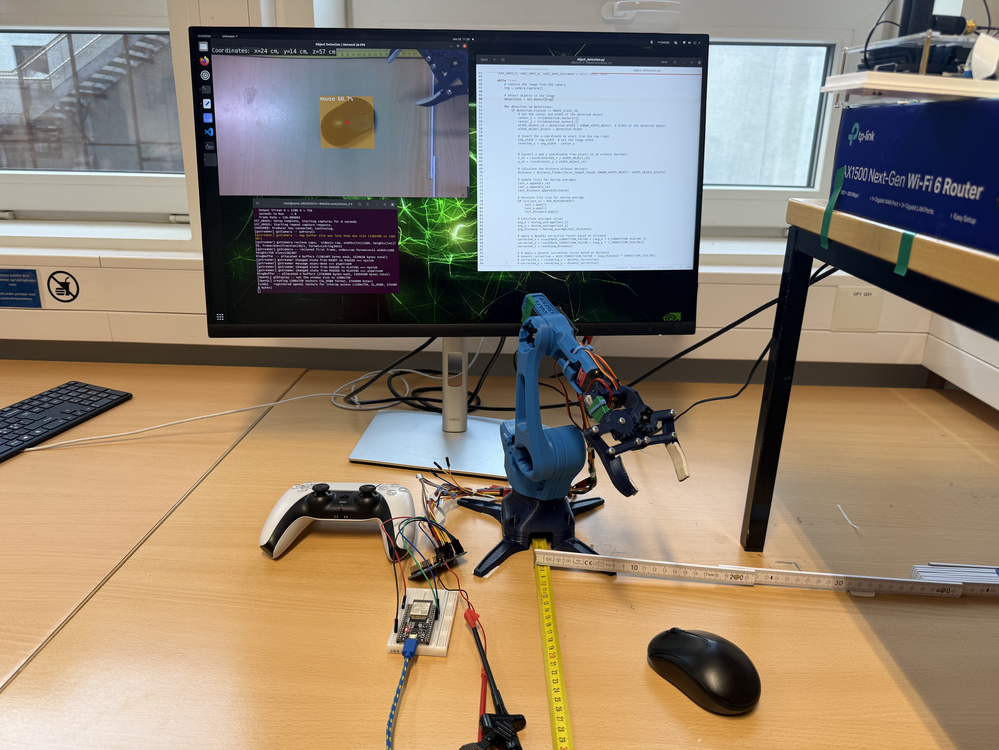
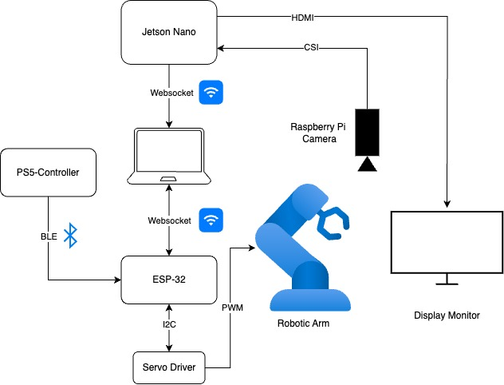

# Robotic Arm with Object Detection

This project is a robotic arm platform designed for both manual and autonomous operation. The system integrates computer vision, kinematic control, and wireless communication to enable advanced manipulation tasks.

---

### System Setup Example

*Figure 1: Physical setup showing the robotic arm, Jetson Nano, ESP32 microcontroller, PS5 controller, and computer vision interface.*

### Operation Modes
- **Manual Mode**: The user can control the robotic arm in real-time using a PS5 controller. The ESP32 interprets controller inputs and actuates the servos accordingly.
- **Autonomous Mode**: The Jetson Nano uses computer vision to detect objects, plan pick-and-place actions, and send movement commands to the ESP32 for execution.

### Repository Structure
The project files are organized into three main folders, each representing a core section of the project:

- `IK (Kinematics)`: Contains files related to kinematic computations, including forward and inverse kinematics algorithms and utilities for robotic arm movement.
- `Jetson_CV (Computer Vision)`: Focused on computer vision tasks handled by the Nvidia Jetson Nano, such as object detection, camera interfacing, and deep learning models.
- `m_Control (Microcontroller and server)`: Includes files for ESP32 firmware, servo control, manual control (e.g., PS5 controller integration), and websocket-based communication between components.

---
### Hardware Components

*Figure 2: System architecture illustrating the connections between Jetson Nano, ESP32, PS5 controller, camera, and robotic arm.*

- **Nvidia Jetson Nano**: Runs computer vision algorithms for object detection and autonomous control. Processes camera input and sends commands to the microcontroller.
- **ESP32 Microcontroller**: Receives commands from the Jetson Nano (or PS5 controller) and controls the servos. Handles wireless communication and real-time actuation.
- **Servos**: Provide precise movement for the robotic arm joints, enabling complex manipulation tasks.
- **PS5 Controller**: Allows for manual operation of the robotic arm via Bluetooth connection to the ESP32.
---

### Licenses
This project is for educational and research purposes.
